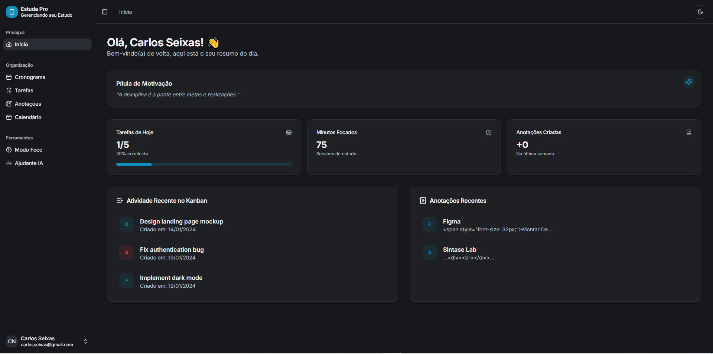
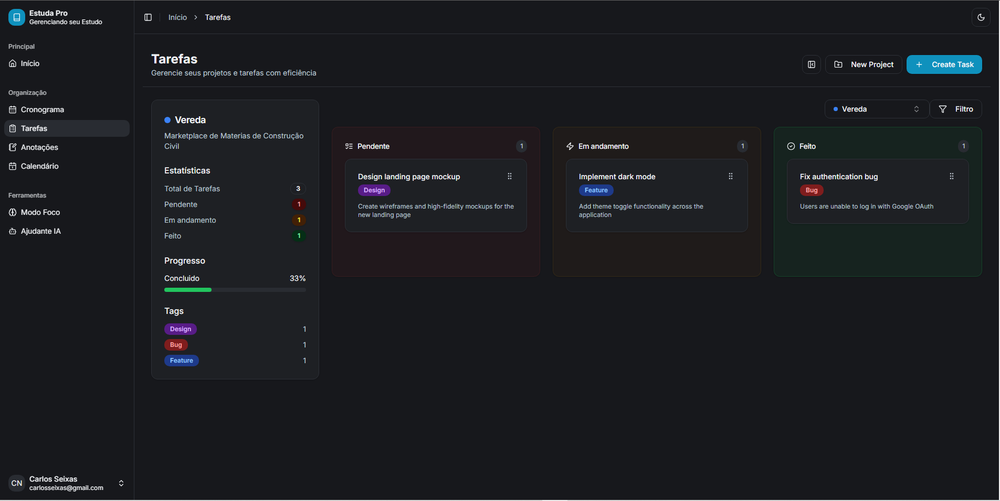
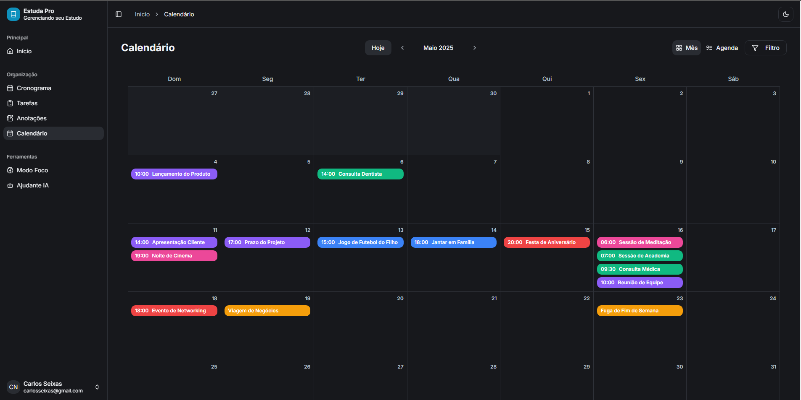
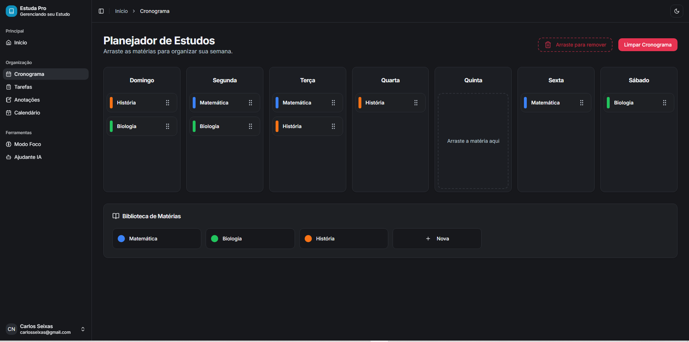
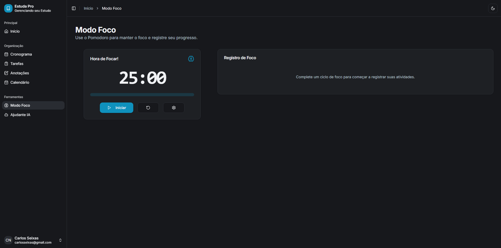
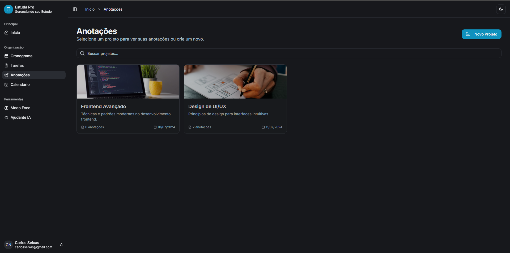
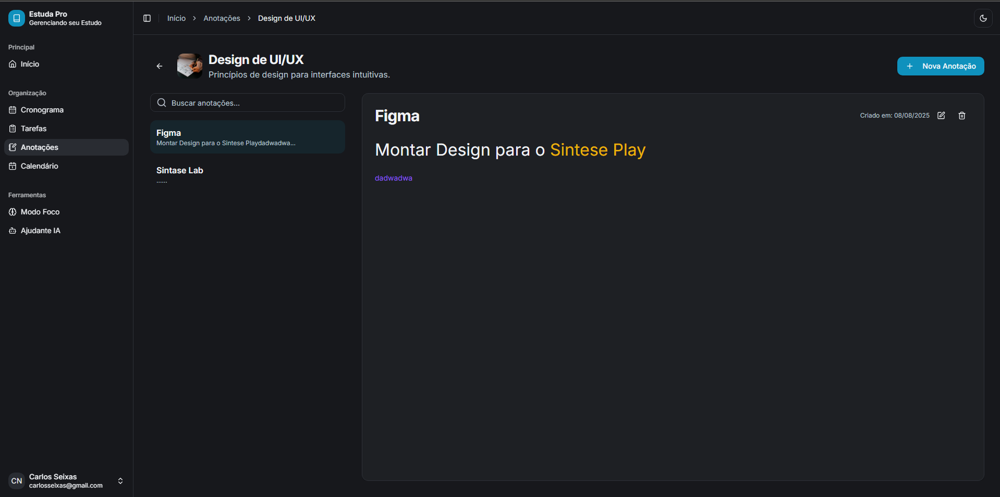
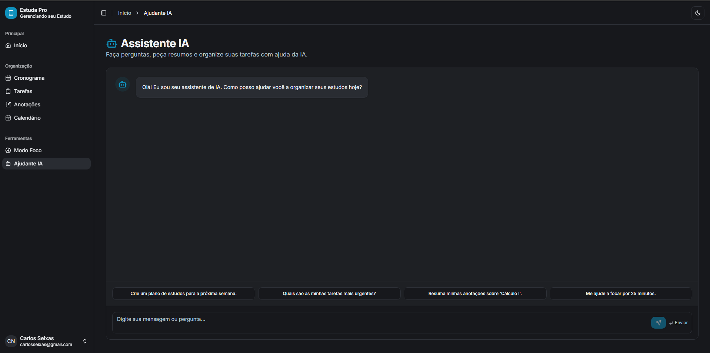

# 📚 EstudaPro

> **Uma plataforma completa de estudos inteligente** desenvolvida com React, TypeScript e TailwindCSS

**EstudaPro** é uma aplicação web moderna projetada para otimizar sua produtividade acadêmica. Combine organização de tarefas, técnicas de foco, anotações inteligentes e assistente IA em uma única plataforma elegante e intuitiva.

---

## ✨ Funcionalidades Principais

### 🏠 Dashboard Intuitivo

Visualize seu progresso diário com resumos de tarefas, tempo de foco e frases motivacionais.



### 📋 Gerenciamento de Tarefas Kanban

Organize suas atividades com sistema Kanban drag-and-drop, categorização por projetos e filtros inteligentes.



### 📅 Calendário Inteligente

Planeje seus estudos com visualização mensal, eventos personalizados e integração com suas tarefas.



### ⏰ Cronograma de Estudos

Crie cronogramas detalhados com matérias, horários e acompanhe seu progresso.



### 🎯 Modo Foco (Pomodoro)

Maximize sua concentração com timer Pomodoro integrado, sessões personalizáveis e histórico de produtividade.



### 📝 Sistema de Anotações

Crie, organize e gerencie suas anotações com editor rico, categorização e busca avançada.



### 📖 Projetos de Anotação

Organize suas anotações em projetos específicos para melhor estruturação do conhecimento.



### 🤖 Assistente IA

Conte com um assistente inteligente para esclarecer dúvidas e otimizar seus estudos.



---

## 🚀 Tecnologias Utilizadas

### Frontend

- **React 19** - Biblioteca para interface de usuário
- **TypeScript** - Superset JavaScript com tipagem estática
- **Vite** - Build tool ultra-rápida
- **React Router Dom** - Roteamento SPA
- **TailwindCSS** - Framework CSS utility-first

### UI/UX

- **Radix UI** - Componentes acessíveis e customizáveis
- **Lucide React** - Ícones modernos
- **Framer Motion** - Animações fluidas
- **Class Variance Authority** - Gerenciamento de variantes CSS

### Funcionalidades Avançadas

- **DND Kit** - Sistema drag-and-drop
- **React Colorful** - Seletor de cores
- **Date-fns** - Manipulação de datas
- **UUID** - Geração de identificadores únicos

### Desenvolvimento

- **ESLint** - Linting e qualidade de código
- **PostCSS** - Processamento CSS
- **JSON Server** - Mock API para desenvolvimento

---

## 📦 Instalação e Execução

### Pré-requisitos

- Node.js 18+
- npm ou yarn

### Instalação

1. **Clone o repositório:**

   ```bash
   git clone https://github.com/CarlosSeixas2/EstudaPro.git
   cd EstudaPro
   ```

2. **Instale as dependências:**

   ```bash
   npm install
   ```

3. **Execute a aplicação:**

   ```bash
   # Desenvolvimento (frontend + mock API)
   npm start

   # Ou apenas o frontend
   npm run dev

   # Apenas o servidor mock
   npm run server
   ```

4. **Acesse a aplicação:**
   - Frontend: `http://localhost:5173`
   - API Mock: `http://localhost:3001`

### Scripts Disponíveis

- `npm start` - Inicia frontend e API mock simultaneamente
- `npm run dev` - Inicia apenas o servidor de desenvolvimento
- `npm run server` - Inicia apenas o servidor JSON mock
- `npm run build` - Gera build de produção
- `npm run preview` - Visualiza build de produção
- `npm run lint` - Executa análise de código

---

## 🏗️ Arquitetura do Projeto

```
EstudaPro/
├── public/                     # Arquivos estáticos
├── src/
│   ├── components/            # Componentes reutilizáveis
│   │   ├── atoms/            # Componentes básicos
│   │   ├── molecules/        # Componentes intermediários
│   │   ├── organisms/        # Componentes complexos
│   │   └── ui/              # Componentes de interface
│   ├── contexts/             # Context API providers
│   ├── hooks/               # Custom React hooks
│   ├── layouts/             # Layouts da aplicação
│   ├── lib/                 # Utilitários e configurações
│   ├── pages/              # Páginas da aplicação
│   ├── routes/             # Configuração de rotas
│   ├── templates/          # Templates de páginas
│   ├── types/              # Definições TypeScript
│   └── assets/             # Recursos estáticos
├── db.json                 # Banco de dados mock
├── tailwind.config.js      # Configuração Tailwind
├── vite.config.ts          # Configuração Vite
└── tsconfig.json          # Configuração TypeScript
```

---

## 🎯 Roadmap

### ✅ Funcionalidades Implementadas

- [x] Dashboard com resumo diário
- [x] Sistema Kanban para tarefas
- [x] Calendário interativo
- [x] Timer Pomodoro
- [x] Editor de anotações
- [x] Assistente IA integrado
- [x] Tema escuro/claro
- [x] Interface responsiva

### 🔄 Em Desenvolvimento

- [ ] Sincronização offline
- [ ] Exportação de dados
- [ ] Colaboração em tempo real
- [ ] Integração com Google Calendar

### 🎯 Próximas Features

- [ ] Aplicativo móvel (React Native)
- [ ] Gamificação e conquistas
- [ ] Relatórios de produtividade
- [ ] Integração com APIs externas

---

## 🤝 Como Contribuir

1. **Fork o projeto**
2. **Crie uma branch para sua feature:**
   ```bash
   git checkout -b feature/nova-funcionalidade
   ```
3. **Commit suas mudanças:**
   ```bash
   git commit -m 'feat: adiciona nova funcionalidade'
   ```
4. **Push para a branch:**
   ```bash
   git push origin feature/nova-funcionalidade
   ```
5. **Abra um Pull Request**

### Padrões de Commit

- `feat:` - Nova funcionalidade
- `fix:` - Correção de bug
- `docs:` - Documentação
- `style:` - Formatação
- `refactor:` - Refatoração
- `test:` - Testes

---

## 📄 Licença

Este projeto está sob a licença **MIT**. Consulte o arquivo `LICENSE` para mais detalhes.

---

## 👨‍💻 Autor

**Carlos Seixas**

- GitHub: [@CarlosSeixas2](https://github.com/CarlosSeixas2)
- LinkedIn: [Carlos Seixas](https://linkedin.com/in/carlos-seixas)

---

<div align="center">
  
**🌟 Se este projeto te ajudou, considere dar uma estrela! 🌟**

Feito com ❤️ e muito ☕ por **Carlos Seixas**

</div>
